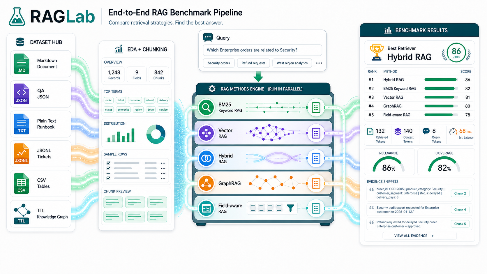
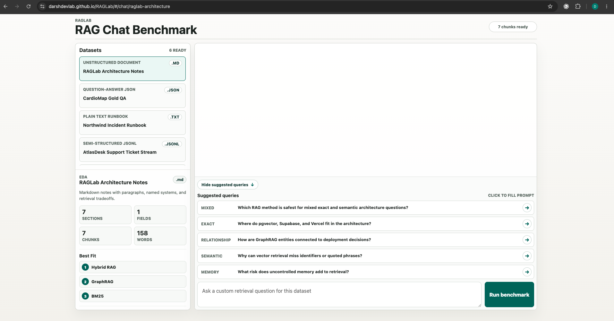
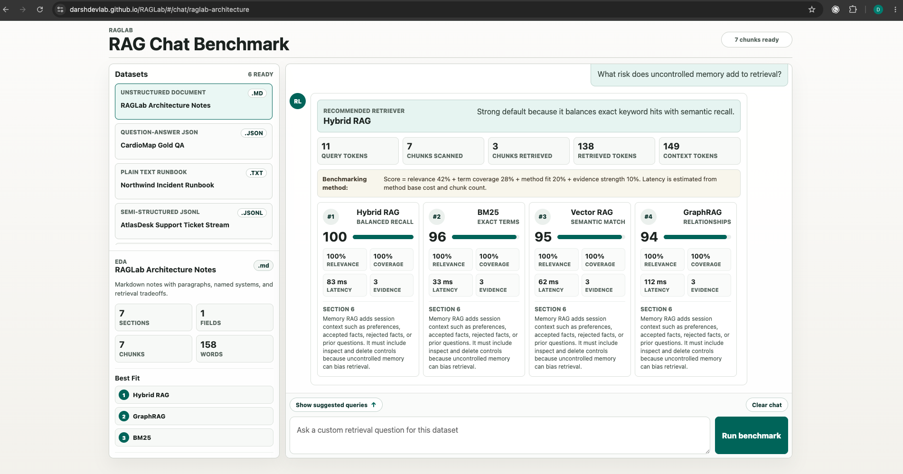

# RAGLab

RAGLab is a full-stack portfolio prototype for comparing RAG strategies on the same dataset.

**Live demo:** https://darshdevlab.github.io/RAGLab/



## Screenshots

Suggested-query chat workspace:



Benchmark results view:



It runs real local retrieval engines:

- BM25 / keyword RAG
- Vector RAG with local TF-IDF cosine vectors
- Hybrid RAG with normalized BM25 + vector scores
- Memory RAG with SQLite-backed session memory
- GraphRAG with entity and relation traversal

Built-in demo datasets:

- RAGLab Architecture Notes: unstructured Markdown document, `.md`.
- CardioMap Gold QA: question-answer benchmark fixtures, `.json`.
- Northwind Incident Runbook: plain text operational runbook, `.txt`.
- AtlasDesk Support Ticket Stream: semi-structured ticket records, `.jsonl`.
- Retail Orders Table: structured tabular data, `.csv`.
- RAG Method Knowledge Graph: RDF-style relationship triples, `.ttl`.

Current public UI:

- The interface is a ChatGPT/Claude-style workspace with datasets on the left and a benchmark chat on the right.
- Clicking a dataset loads compact EDA in the left sidebar: corpus counts, chunks, best-fit retrievers, top terms, samples, and a download control.
- The chat panel shows the selected dataset, prepared query options, and a custom prompt box.
- Running a prepared query or custom prompt compares BM25, Vector RAG, Hybrid RAG, GraphRAG, and Field-aware RAG side by side with score, relevance, coverage, latency, evidence count, retrieved evidence, and token telemetry.
- Each dataset file can be downloaded in its own format from the browser.
- Upload and write-memory controls remain hidden for the public portfolio demo.

The local version avoids npm, pip, and external LLM APIs so the product behavior can be verified first. The hosted version uses Supabase for seeded demo documents, chunks, pgvector embeddings, keyword search, demo memory, entities, and relations.

## Live Architecture

- Frontend: static browser UI, publishable on GitHub Pages or Vercel.
- Backend: Supabase Edge Function `raglab`, deployed as a public read-only demo API.
- Database: Supabase Postgres tables prefixed with `raglab_`.
- Vector search: Supabase pgvector on `raglab_chunks.embedding`.
- Keyword search: Postgres full-text search RPC.
- File storage: private Supabase bucket `raglab_documents`.
- Demo site bucket: `raglab_site` exists, but Supabase serves HTML as text, so GitHub Pages/Vercel is the correct frontend host.

## Security Model

- No Supabase service key, database password, LLM key, or GitHub token is stored in the browser bundle or repository.
- GitHub Pages serves static files only. GitHub environment secrets would not hide values from browser JavaScript, so the public demo does not use client-side secrets.
- The hosted `raglab` Edge Function uses Supabase runtime secrets server-side and is intentionally public because there is no auth for the portfolio demo.
- Public write paths are disabled in the hosted function: `POST /api/dataset/text` and `POST /api/memory` return `403`.
- Public queries are restricted to the four seeded demo dataset IDs and do not insert run logs, result rows, evidence rows, uploads, or memories.
- The UI is demo-only, shows prepared benchmark datasets, and does not show upload controls.

## Run Locally

One command:

```bash
cd /Volumes/LocalDrive1/ProductPorfolio/Projects/RAGLab
python3 backend/server.py --port 8787
```

Open:

```text
http://127.0.0.1:8787
```

## API

```text
GET  /api/health
GET  /api/demos
GET  /api/dataset
GET  /api/dataset/file?slug={demo_slug}
GET  /api/dataset/download?slug={demo_slug}
POST /api/dataset/sample
POST /api/query
GET  /api/memory/{session_id}
POST /api/memory
```

In the hosted API, custom dataset indexing and memory writes are disabled for safety. The blocked `POST /api/dataset/text` endpoint remains server-side only as a defensive fallback and returns `403`.

## Hosted API

The hosted API base is:

```text
https://peluzzqoihjvkdtedsiz.supabase.co/functions/v1/raglab
```

Live demo:

```text
https://darshdevlab.github.io/RAGLab/
```

GitHub repo:

```text
https://github.com/darshdevlab/RAGLab
```

The frontend automatically uses the hosted API outside localhost and keeps relative `/api` calls when run through the local Python server.

## Deployment Direction

Use GitHub Pages or Vercel for the frontend. Use Supabase for hosted demo retrieval:

- Supabase Storage: private seeded documents
- Postgres: seeded documents, chunks, metadata, demo memory, entities, relations
- pgvector: vector search
- Postgres full-text search: BM25/keyword retrieval
- Tables: datasets, documents, chunks, memory, entities, relations

The product compares RAG methods, not vector database vendors. Qdrant, Pinecone, Weaviate, or Neo4j can be added later as adapters if the project becomes a database benchmark.
